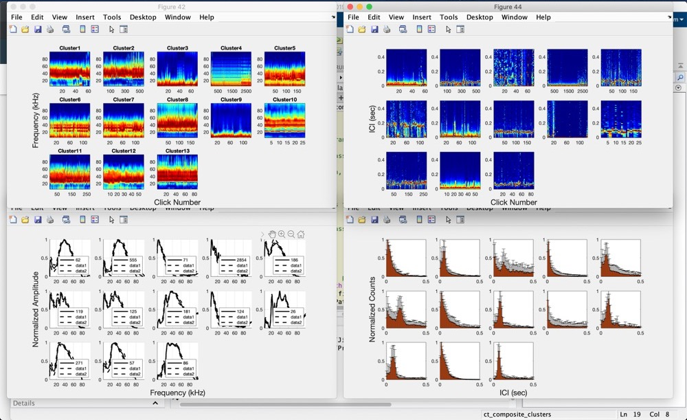
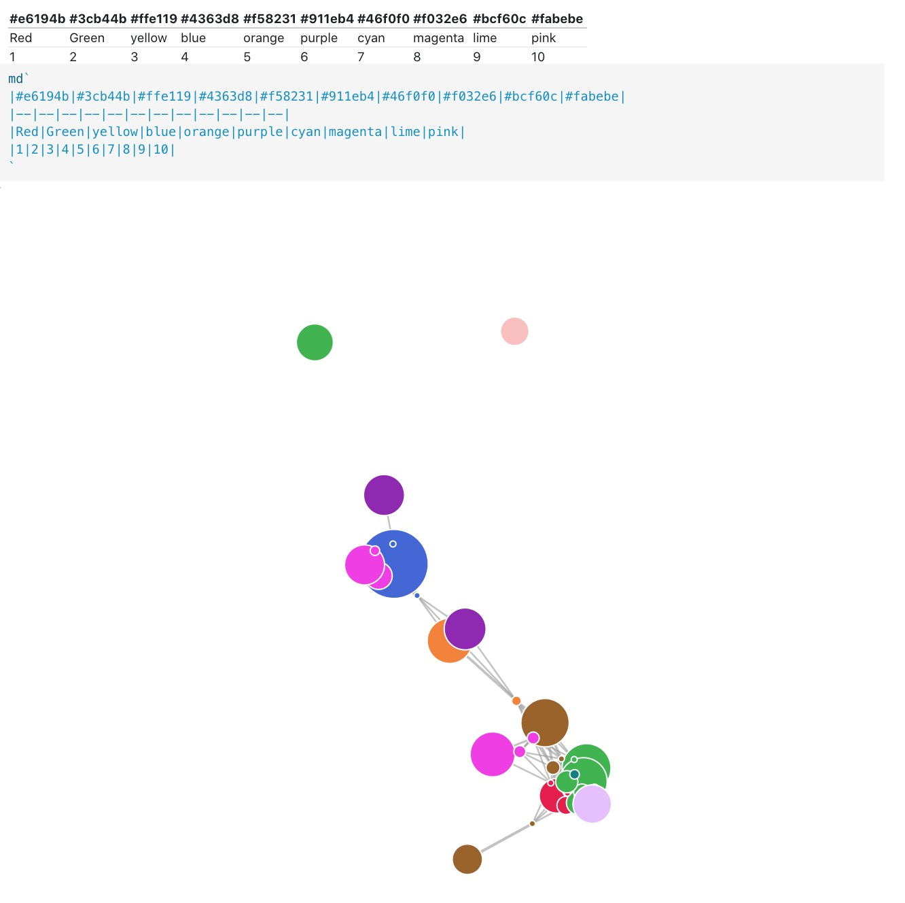

# Entropy Analysis

We first ran Kait's clustering algorithm on `cluster_bins_icimax1` 200 times. Kait's clustering algorithm assigns the same label to same cluster across different repetitions. Here is one sample of Kait's clustering results.

As can see in the piture, Kait's clustering algorithm estimates ~13 clusters from the data samples.

After 200 repetitions, for each sample we have 200 labels that Kait's clustering algorithm assigns to, which we call the label vector.

## Group samples into cluster

Next, we group samples that have the same label vector into cluster. Samples in the cluster get assigned the same label across 200 repetitions, which we call stable cluster. The size of the cluster is determined by how many samples with same label vector are grouped into it.

## Hamming distance between label vector

Some samples' label vector may share a large portion of same labels while differing in few labels with the stable cluster's label vector. The number of labels that are different in two label vectors is called label vector hamming distance. Samples whose label vector has smaller hamming distance are likely belongs to the same cluster. 

## Visualize the graph using d3 force-directed graph

After grouping samples into clusters and calculating distance between samples, we end up a graph with nodes and edges. Then we plot the graph using d3 force-directed graph.

