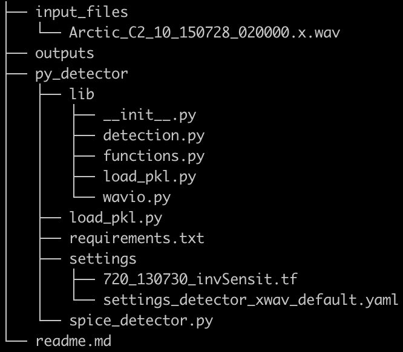

## 1. Install Dependency

`pip install -r requirements.txt`

## 2. File Structure

## 3. Run Detector

`python py_detector/spice_detector.py` :

runs detector in default settings

## 4. Outputs:

`xxx.pkl` : pickle file that stores setting (params) values

`xxx.txt`: txt file that contains detected click periods

## 5. More

[de_batch.ipynb](<https://github.com/Jingwu010/BeakedWhaleClassification/blob/master/Jingwu/de_batch.ipynb>)