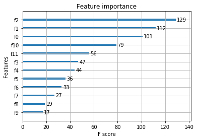
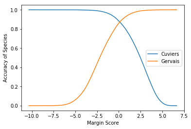
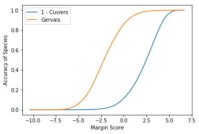

# XGBoost Analysis
---
Extracts from the code notebook [XGBoost.ipynb](./XGBoost.ipynb)

## Preprocessing
The data files were preprocessed on PySpark (10 nodes) cluster. The code for the same can be found [here](./emr_processing/DataProcessing.ipynb). The preprocessed is a numpy array with `4144531` rows with following columns (zero-indexed):
* Col 0-9: projections on first 10 eigen vectors
* Col 10: rmse
* Col 11: peak2peak
* Col 12: label (`0 if row.species==u'Gervais' else 1`)

## Train/Validation/Test Split
The data is shuffled and divided as follow:
* Training: 70%
* Validation: 15%
* Testing: 15%

## Parameters for XG Boost
* Maximum Depth of the Tree = 3
* Step size shrinkage used in update to prevents overfitting = 0.3
* Evaluation Criterion: `Maximize Logliklihood`
* Maximum Number of Iterations = 100

## Feature Importance
Looking at the feature importance of the trained model, we realize that Eigen Projection 2, Eigen Projection 3, Eigen Projection 1, RMSE and Peak2Peak are the most important features. Below is the plot of the feature importance:

## Margin Plots
Following plot was obtained by selecting different margins as a threshold for the classification.

The same plot plotted by inverting the plot for label 0 to find a common margin for both is shown below.

